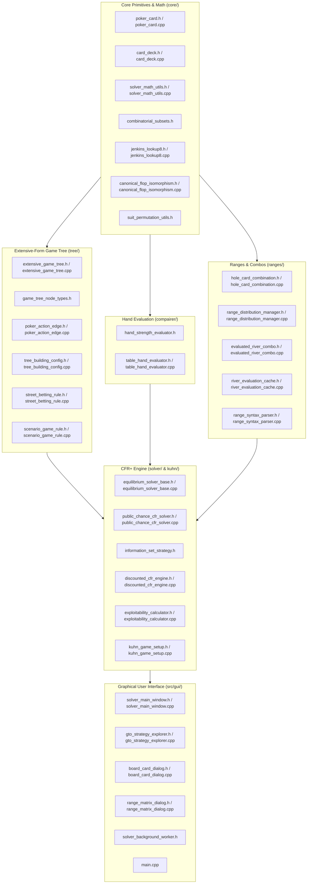

# PokerSolver: Essential Codebase Files Reference Guide

This document provides a comprehensive technical overview and description of every essential file in the **PokerSolver** repository. It reflects the modular directory structure organized by subsystem into `include/poker_solver/<module>/`, `src/<module>/`, `src/gui/`, and `tests/`. All file names and interfaces have been decoupled from the reference solver (`reference_solver` / TexasSolver) and modernized into clean, distinctive snake_case naming conventions with modern C++20 styles.

---

## 1. System Architecture Map

---

## 2. Core Poker Primitives & Combinatorics (`core/`)

### [include/poker_solver/core/poker_card.h](file:///Users/sanch_bo/Documents/PokerSolver/include/poker_solver/core/poker_card.h) & [src/core/poker_card.cpp](file:///Users/sanch_bo/Documents/PokerSolver/src/core/poker_card.cpp)
- **Role**: Foundational card representation and 64-bit bitboard algebra.
- **Key Symbols**:
  - `class Card` (aliased as `PokerCard`): Represents an individual playing card or empty state (`std::optional<int> card_int_`).
  - Constants: `kNumCardsInDeck = 52`, `kNumSuits = 4`, `kNumRanks = 13`.
  - Encoding formula: `card_int = rank * 4 + suit` (where suits are `0=s, 1=h, 2=d, 3=c` and ranks are `0=2, ..., 12=A`).
- **Core Algorithms & Modern Methods**:
  - `card_int_to_uint64(int card_int)` / `CardIntToUint64`: Converts a card index to bitmask `1ULL << card_int`.
  - `do_boards_overlap(uint64_t b1, uint64_t b2)` / `DoBoardsOverlap`: Returns `(b1 & b2) != 0` in a single CPU cycle.
  - `uint64_to_card_ints(uint64_t mask)` / `Uint64ToCardInts`: Bit-scans an aggregate board mask into a list of card integers.
  - `int_to_string(int card_int)` / `IntToString`: Returns string representation like `"As"`, `"Td"`.

### [include/poker_solver/core/card_deck.h](file:///Users/sanch_bo/Documents/PokerSolver/include/poker_solver/core/card_deck.h) & [src/core/card_deck.cpp](file:///Users/sanch_bo/Documents/PokerSolver/src/core/card_deck.cpp)
- **Role**: Represents a customizable deck of cards (standard 52-card Hold'em or short-deck).
- **Key Symbols**:
  - `class Deck` (aliased as `CardDeck`): Contains list of ranks, suits, and card strings.
  - `cards()` / `GetCards()`: Returns all available cards.
  - `contains(const Card&)` / `Contains`: Checks card membership.
  - `size()`: Returns total card count in the deck.

### [include/poker_solver/core/combinatorial_subsets.h](file:///Users/sanch_bo/Documents/PokerSolver/include/poker_solver/core/combinatorial_subsets.h)
- **Role**: Header-only template utility for combinatorial sampling (n choose k).
- **Key Symbols**:
  - `template<typename T> class SimpleCombinations` (aliased as `CombinatorialSubsets<T>`): Generates all unordered subsets of size k from input vector n.
  - `get_combinations()` / `GetCombinations()`: Returns the precomputed subsets.
  - Used by chance node dealing algorithms when enumerating possible turn/river cards.

### [include/poker_solver/core/jenkins_lookup8.h](file:///Users/sanch_bo/Documents/PokerSolver/include/poker_solver/core/jenkins_lookup8.h) & [src/core/jenkins_lookup8.cpp](file:///Users/sanch_bo/Documents/PokerSolver/src/core/jenkins_lookup8.cpp)
- **Role**: High-performance 64-bit integer mixing and hashing algorithm by Bob Jenkins.
- **Key Symbols**:
  - `lookup8_hash(const uint8_t* key, size_t length, uint64_t initval)`: Produces non-cryptographic 64-bit hash values.
  - `mix(uint64_t& a, uint64_t& b, uint64_t& c)`: In-place 3-way reversible mixing.
  - Used for rapid board mask and canonical state hashing.

### [include/poker_solver/core/canonical_flop_isomorphism.h](file:///Users/sanch_bo/Documents/PokerSolver/include/poker_solver/core/canonical_flop_isomorphism.h) & [src/core/canonical_flop_isomorphism.cpp](file:///Users/sanch_bo/Documents/PokerSolver/src/core/canonical_flop_isomorphism.cpp)
- **Role**: Compresses game tree state space by grouping strategically equivalent suit permutations.
- **Key Algorithms**:
  - `get_canonical_flops()` / `GetCanonicalFlops()`: Reduces the 22,100 possible flop deals to **1,755 canonical flops** with weights summing to 22,100.
  - `get_canonical_board(uint64_t board_mask)` / `GetCanonicalBoard()`: Renames suits such that the first seen suit is Spades, second is Hearts, etc., generating a canonical board key.
  - `get_color_iso_offset(uint64_t board_mask)` / `GetColorIsoOffset()`: Calculates color permutation offsets for Turn and River card deals. In isomorphic suits, solving is skipped and results are mapped back via color permutation (`exchange_color`).
  - Aliased as `CanonicalFlopIsomorphism`.

### [include/poker_solver/core/suit_permutation_utils.h](file:///Users/sanch_bo/Documents/PokerSolver/include/poker_solver/core/suit_permutation_utils.h)
- **Role**: Isomorphism color exchange routines (`exchange_color_isomorphism`) mapping strategy and reach arrays between suit permutations.

### [include/poker_solver/core/solver_math_utils.h](file:///Users/sanch_bo/Documents/PokerSolver/include/poker_solver/core/solver_math_utils.h) & [src/core/solver_math_utils.cpp](file:///Users/sanch_bo/Documents/PokerSolver/src/core/solver_math_utils.cpp)
- **Role**: General mathematical and string utilities across tokenization, random number generation, and payoff normalization.
- **Key Symbols**:
  - `string_split(string_view, char delimiter)`: High-performance string tokenization.
  - `get_random_int(int min, int max)`: Thread-safe uniform random integer generation via thread-local Mersenne Twister.
  - `time_since_epoch_millisec()`: High-resolution timestamp generator.
  - `normalize_tanh(double stack, double ev, double ratio)`: Scaled hyperbolic tangent payoff normalization.
  - `template<typename T> class Combinations`: Full combinatorial generator with size calculation.

---

## 3. Game Tree & Representation (`tree/`)

### [include/poker_solver/tree/game_tree_node_types.h](file:///Users/sanch_bo/Documents/PokerSolver/include/poker_solver/tree/game_tree_node_types.h)
- **Role**: Node types and flat reference identifier (`NodeRef`) for the game tree.
- **Key Symbols**:
  - `enum class GameRound`: `kPreflop (0)`, `kFlop (1)`, `kTurn (2)`, `kRiver (3)`.
  - `enum class GameTreeNodeType : uint8_t`: `kAction (0)`, `kChance (1)`, `kShowdown (2)`, `kTerminal (3)`.
  - `enum class PokerAction`: `kBegin`, `kRoundBegin`, `kBet`, `kRaise`, `kCheck`, `kFold`, `kCall`.
  - `struct NodeRef`: Compact 64-bit handle `{ GameTreeNodeType type; uint32_t index; }`.
  - `kNullNode`: Sentinel node `{ kTerminal, 0xFFFFFFFF }`.
  - `class GameTreeNode`: Static helpers `int_to_game_round`, `game_round_to_int`, `game_round_to_string`.

### [include/poker_solver/tree/poker_action_edge.h](file:///Users/sanch_bo/Documents/PokerSolver/include/poker_solver/tree/poker_action_edge.h) & [src/tree/poker_action_edge.cpp](file:///Users/sanch_bo/Documents/PokerSolver/src/tree/poker_action_edge.cpp)
- **Role**: Poker action edge representation and string serialization.
- **Key Symbols**:
  - `class GameAction` (aliased as `PokerActionEdge`): Encapsulates `PokerAction action_` and chip size `double amount_`.
  - `action()`, `amount()`, `to_string()`: Modern snake_case accessors.
  - `action_to_string(PokerAction action)`: Formats actions as `"CHECK"`, `"CALL"`, `"FOLD"`, `"BET 50.0"`, `"RAISE 100.0"`.

### [include/poker_solver/tree/extensive_game_tree.h](file:///Users/sanch_bo/Documents/PokerSolver/include/poker_solver/tree/extensive_game_tree.h) & [src/tree/extensive_game_tree.cpp](file:///Users/sanch_bo/Documents/PokerSolver/src/tree/extensive_game_tree.cpp)
- **Role**: Vector-backed flat extensive-form game tree (Structure of Arrays).
- **Key Features**:
  - Avoids pointer-heavy graphs and virtual method dispatches. Stores all nodes in contiguous vectors:
    - `action_edges_`: Contiguous buffer of `Edge { GameAction, NodeRef child }`.
    - `action_first_edge_`, `action_num_edges_`: Offset spans into edge storage.
    - `terminal_payoffs_`, `showdown_payoffs_`: Flat array of player chip commitments and payoffs.
  - `get_action_edges(uint32_t idx)` / `GetActionEdges`: Returns `std::span<const Edge>` (zero-copy).
  - `get_root()` / `GetRoot()`: Returns root `NodeRef`.
  - `calculate_tree_metadata()`, `print_tree(int max_depth)`, `estimate_trainable_memory(...)`: Tree analysis utilities.
  - `build_action_node(...)`: Recursively constructs betting trees (checks, bets, raises, folds, calls) respecting stack caps and raise limits.
  - `build_chance_node(...)`: Constructs transition points from Flop to Turn and Turn to River, routing to River betting actions if chips remain or Showdown if all-in.
  - `get_trainable(...)` / `set_trainable(...)`: Manages the mapping of canonical board hashes and action nodes to `Trainable` strategy instances.
  - Aliased as `ExtensiveGameTree`.

### [include/poker_solver/tree/street_betting_rule.h](file:///Users/sanch_bo/Documents/PokerSolver/include/poker_solver/tree/street_betting_rule.h) & [src/tree/street_betting_rule.cpp](file:///Users/sanch_bo/Documents/PokerSolver/src/tree/street_betting_rule.cpp)
- **Role**: Betting structure parameters for a single street and player.
- **Key Fields**:
  - `bet_sizes_percent`: Vector of bet sizes as percentage of pot (e.g. `[33, 50, 75]`).
  - `raise_sizes_percent`: Vector of raise sizes as percentage of pot.
  - `donk_sizes_percent`: Donk bet sizes (for OOP players).
  - `allow_all_in`: Boolean flag indicating whether all-in actions are generated.
  - Aliased as `StreetBettingRule`.

### [include/poker_solver/tree/tree_building_config.h](file:///Users/sanch_bo/Documents/PokerSolver/include/poker_solver/tree/tree_building_config.h) & [src/tree/tree_building_config.cpp](file:///Users/sanch_bo/Documents/PokerSolver/src/tree/tree_building_config.cpp)
- **Role**: Container aggregating street settings for IP and OOP across Flop, Turn, and River.
- **Key Accessor**:
  - `get_setting(size_t player, GameRound round)` / `GetSetting`: Returns `StreetSetting` for that specific street and player position.
  - Aliased as `TreeBuildingConfig`.

### [include/poker_solver/tree/scenario_game_rule.h](file:///Users/sanch_bo/Documents/PokerSolver/include/poker_solver/tree/scenario_game_rule.h) & [src/tree/scenario_game_rule.cpp](file:///Users/sanch_bo/Documents/PokerSolver/src/tree/scenario_game_rule.cpp)
- **Role**: Complete rule definition for a scenario.
- **Key Methods**:
  - `initial_board_cards_int()`, `starting_round()`: Initial deal settings.
  - `initial_pot()`, `initial_commitment(size_t player)`: Pot and commitment trackers.
  - `initial_effective_stack()`, `raise_limit_per_street()`, `all_in_threshold_ratio()`: Limits and stack settings.
  - Aliased as `ScenarioGameRule`.

---

## 4. Hand Evaluation (`compairer/`)

### [include/poker_solver/compairer/hand_strength_evaluator.h](file:///Users/sanch_bo/Documents/PokerSolver/include/poker_solver/compairer/hand_strength_evaluator.h)
- **Role**: Abstract interface for 5-card and 7-card poker hand strength evaluation.
- **Key Methods**:
  - `compare_hands(...)` / `CompareHands`: Compares two private hands on a board.
  - `get_hand_rank(...)` / `GetHandRank`: Returns numerical rank (lower is stronger).
  - Aliased as `HandStrengthEvaluator`.

### [include/poker_solver/compairer/table_hand_evaluator.h](file:///Users/sanch_bo/Documents/PokerSolver/include/poker_solver/compairer/table_hand_evaluator.h) & [src/compairer/table_hand_evaluator.cpp](file:///Users/sanch_bo/Documents/PokerSolver/src/compairer/table_hand_evaluator.cpp)
- **Role**: Precomputed dictionary hand evaluator with binary disk cache.
- **Key Algorithms**:
  - Precomputes 5,148 flush hand ranks and 6,175 non-flush equivalence classes.
  - Maps 7-card combinations (5 board + 2 hole cards) to the best 5-card sub-rank by selecting the maximum rank among all 21 subsets.
  - Binary serialization (`save_binary_cache`, `load_binary_cache`): Loads `five_card_strength.bin` in **3 ms** versus 1.5 seconds from raw text files.
  - Aliased as `TableHandEvaluator`.

---

## 5. Ranges & Combinatorics (`ranges/`)

### [include/poker_solver/ranges/hole_card_combination.h](file:///Users/sanch_bo/Documents/PokerSolver/include/poker_solver/ranges/hole_card_combination.h) & [src/ranges/hole_card_combination.cpp](file:///Users/sanch_bo/Documents/PokerSolver/src/ranges/hole_card_combination.cpp)
- **Role**: Represents a two-card private hand combination with initial weight.
- **Key Symbols**:
  - `class PrivateCards` (aliased as `HoleCardCombination`): Holds `card1_int_`, `card2_int_`, and `weight_`.
  - `board_mask()` / `GetBoardMask()`: Returns 64-bit mask `(1ULL << card1) | (1ULL << card2)`.
  - `to_string()` / `ToString()`: Formats combo (e.g. `"AsKs"`).
  - `std::hash<PrivateCards>`: Fast hash specialization based on the 64-bit bitmask.

### [include/poker_solver/ranges/range_distribution_manager.h](file:///Users/sanch_bo/Documents/PokerSolver/include/poker_solver/ranges/range_distribution_manager.h) & [src/ranges/range_distribution_manager.cpp](file:///Users/sanch_bo/Documents/PokerSolver/src/ranges/range_distribution_manager.cpp)
- **Role**: Manages starting player ranges and computes initial reach probability vectors.
- **Key Symbols**:
  - `PrivateCardsManager(initial_ranges, initial_board_mask)`: Eliminates combos conflicting with the initial board.
  - `get_initial_reach_probs(player_idx)` / `GetInitialReachProbs`: Normalizes probability masses over legal hole card combinations.
  - `get_opponent_hand_index(from_p, to_p, hand_idx)` / `GetOpponentHandIndex`: Bidirectional index translation between player ranges.
  - Aliased as `RangeDistributionManager`.

### [include/poker_solver/ranges/evaluated_river_combo.h](file:///Users/sanch_bo/Documents/PokerSolver/include/poker_solver/ranges/evaluated_river_combo.h) & [src/ranges/evaluated_river_combo.cpp](file:///Users/sanch_bo/Documents/PokerSolver/src/ranges/evaluated_river_combo.cpp)
- **Role**: Evaluated river combo structure containing hand rank and original range index.
- **Key Symbols**:
  - `struct RiverCombs` (aliased as `EvaluatedRiverCombo`): Contains `PrivateCards private_cards`, `int rank`, `size_t original_range_index`.
  - `operator<`: Sorts combos by numerical hand rank (descending order).

### [include/poker_solver/ranges/river_evaluation_cache.h](file:///Users/sanch_bo/Documents/PokerSolver/include/poker_solver/ranges/river_evaluation_cache.h) & [src/ranges/river_evaluation_cache.cpp](file:///Users/sanch_bo/Documents/PokerSolver/src/ranges/river_evaluation_cache.cpp)
- **Role**: Thread-safe evaluation cache for player ranges on specific 5-card river boards.
- **Key Algorithms**:
  - `get_river_combos(player_idx, initial_range, river_board_mask)` / `GetRiverCombos`: Checks thread-safe cache (`std::shared_mutex`). On cache miss, evaluates all valid hole cards with `TableHandEvaluator`, sorts them by hand strength, and caches the result.
  - Pre-sorted combos enable the linear two-pointer showdown sweep in the CFR engine.
  - Aliased as `RiverEvaluationCache`.

### [include/poker_solver/ranges/range_syntax_parser.h](file:///Users/sanch_bo/Documents/PokerSolver/include/poker_solver/ranges/range_syntax_parser.h) & [src/ranges/range_syntax_parser.cpp](file:///Users/sanch_bo/Documents/PokerSolver/src/ranges/range_syntax_parser.cpp)
- **Role**: Text range parser converting standard poker notation into discrete combinations.
- **Key Syntax**:
  - Pairs: `AA`, `KK`, `QQ` (6 combos each).
  - Suited combos: `AKs`, `QJs` (4 combos each).
  - Offsuit combos: `AKo`, `T9o` (12 combos each).
  - Specific combos: `AsKs`, `QhJd` (1 combo).
  - Frequency weighting: `AKs:0.5`, `QQ:0.75`.
  - Aliased as `RangeSyntaxParser`.

---

## 6. CFR+ Solving Engine & Verification (`solver/` & `kuhn/`)

### [include/poker_solver/solver/equilibrium_solver_base.h](file:///Users/sanch_bo/Documents/PokerSolver/include/poker_solver/solver/equilibrium_solver_base.h) & [src/solver/equilibrium_solver_base.cpp](file:///Users/sanch_bo/Documents/PokerSolver/src/solver/equilibrium_solver_base.cpp)
- **Role**: Abstract base class for equilibrium solvers.
- **Key Interface**:
  - `virtual void train() = 0` / `Train()`: Executes solving loop.
  - `virtual void stop() = 0` / `Stop()`: Signals solver thread to halt gracefully.
  - `virtual json dump_strategy(...) = 0` / `DumpStrategy()`: Serializes equilibrium strategy.
  - Aliased as `EquilibriumSolverBase`.

### [include/poker_solver/solver/information_set_strategy.h](file:///Users/sanch_bo/Documents/PokerSolver/include/poker_solver/solver/information_set_strategy.h)
- **Role**: Abstract interface for an information set's strategy and regret storage.
- **Key Methods**:
  - `GetCurrentStrategy()`, `GetAverageStrategy()`.
  - `UpdateRegrets(weighted_regrets, iteration)`: Updates counterfactual regrets.
  - `AccumulateAverageStrategy(current_strategy, reach_probs, iteration)`: Updates average strategy.
  - Aliased as `InformationSetStrategy`.

### [include/poker_solver/solver/discounted_cfr_engine.h](file:///Users/sanch_bo/Documents/PokerSolver/include/poker_solver/solver/discounted_cfr_engine.h) & [src/solver/discounted_cfr_engine.cpp](file:///Users/sanch_bo/Documents/PokerSolver/src/solver/discounted_cfr_engine.cpp)
- **Role**: Implementation of the **CFR+** algorithm with regret matching and linear weighting.
- **Key Algorithmic Mechanics**:
  - **Negative Regret Clamping**: `cumulative_regrets_[i] = std::max(0.0, cumulative_regrets_[i])`.
  - **Regret Matching**: Next iteration's strategy is proportional to positive regrets (defaults to uniform if all regrets are zero).
  - **Linear Average Strategy Accumulation**:
    `cumulative_strategy_sum_ += reach_weight * iteration * current_strategy`.
    Later iterations are weighted linearly, discarding early exploratory noise and accelerating convergence from O(1/sqrt(T)) to O(1/T).
  - Aliased as `DiscountedCfrEngine`.

### [include/poker_solver/solver/public_chance_cfr_solver.h](file:///Users/sanch_bo/Documents/PokerSolver/include/poker_solver/solver/public_chance_cfr_solver.h) & [src/solver/public_chance_cfr_solver.cpp](file:///Users/sanch_bo/Documents/PokerSolver/src/solver/public_chance_cfr_solver.cpp)
- **Role**: Public-Chance Counterfactual Regret Minimization (PCFR+) engine.
- **Key Methods & Traversal Architecture**:
  - `train()` / `Train()`: Main multi-threaded loop (`omp_set_num_threads`). Alternates traversers (Player 0 IP, Player 1 OOP) for `iteration_limit`.
  - `compute_ev()` / `ComputeEV()`: Calculates overall expected value across ranges.
  - `cfr_utility(...)`: Master recursive dispatcher:
    - `cfr_action_node`: Pushes reach probabilities along edges, receives counterfactual values, computes regrets (`child_utility[a] - node_utility`), and updates CFR+ trainables.
    - `cfr_chance_node`: Evaluates deal transitions. On flop deals, loops through 1,755 canonical flops in parallel. On turn/river deals, evaluates canonical suits and maps isomorphic results back via `exchange_color`.
    - `cfr_terminal_node`: Computes fold payoffs directly from pot sizes.
    - `cfr_showdown_node`: **Two-pointer sweeping showdown algorithm with card blockers**. Sweeps pre-sorted hands in O(N + M) linear time, subtracting blocked opponent reach masses in O(1) via `oppo_mass_by_card[52]`.
  - `dump_strategy(dump_evs, max_depth, max_chance_outcomes)` / `DumpStrategy`: Serializes the solved game tree into JSON.
  - Aliased as `PublicChanceCfrSolver`.

### [include/poker_solver/solver/exploitability_calculator.h](file:///Users/sanch_bo/Documents/PokerSolver/include/poker_solver/solver/exploitability_calculator.h) & [src/solver/exploitability_calculator.cpp](file:///Users/sanch_bo/Documents/PokerSolver/src/solver/exploitability_calculator.cpp)
- **Role**: Computes exact best-response values and Nash exploitability for strategies.
- **Key Concepts**:
  - Traverses the game tree against fixed average strategies:
    - At opponent action nodes: Computes expected value weighted by opponent strategy frequencies.
    - At hero action nodes: Selects the pure maximum action `max_a (child_ev[a])`.
  - `compute_exploitability_detailed(initial_reach_probs, initial_pot)` / `ComputeExploitabilityDetailed`:
    Returns `ExploitabilityResult`:
    - `player_br_evs[2]`: Best-response EV for both players.
    - `total_exploitability_chips = BR_EV(P0) + BR_EV(P1)`.
    - `exploitability_percent = total_exploitability_chips / (num_players * pot) * 100.0`.
  - In an exact Nash equilibrium, total exploitability is zero.
  - Aliased as `ExploitabilityCalculator`.

### [include/poker_solver/kuhn/kuhn_game_setup.h](file:///Users/sanch_bo/Documents/PokerSolver/include/poker_solver/kuhn/kuhn_game_setup.h) & [src/kuhn/kuhn_game_setup.cpp](file:///Users/sanch_bo/Documents/PokerSolver/src/kuhn/kuhn_game_setup.cpp)
- **Role**: Minimal 3-card (Jack, Queen, King) Kuhn Poker setup used for analytical verification of CFR convergence against closed-form game theory solutions.
- **Key Symbols**:
  - `class KuhnCompairer`: Evaluates single-card comparisons where King beats Queen and Queen beats Jack.
  - `build_kuhn_game_tree()`: Builds the exact Kuhn betting tree.

---

## 7. Graphical User Interface (`src/gui/`)

### [src/gui/main.cpp](file:///Users/sanch_bo/Documents/PokerSolver/src/gui/main.cpp)
- **Role**: Application entry point. Initializes `QApplication` and displays `MainWindow`.

### [src/gui/solver_main_window.h](file:///Users/sanch_bo/Documents/PokerSolver/src/gui/solver_main_window.h) & [src/gui/solver_main_window.cpp](file:///Users/sanch_bo/Documents/PokerSolver/src/gui/solver_main_window.cpp)
- **Role**: Main application control panel.
- **Features**:
  - Board configuration: Integrates board inputs and card selection dialog. Automatically sets starting street (`Flop`, `Turn`, `River`) based on card count (3, 4, or 5).
  - Betting parameters: Raise limits, pot sizes, effective stacks, bet sizes per street.
  - Background solving: Launches `SolverWorker` in dedicated `QThread` with 8 MB stack size.
  - Zero-copy IPC: Receives `QSharedPointer<nlohmann::json>` from solver worker without main-thread serialization stalls.
  - Aliased as `SolverMainWindow`.

### [src/gui/board_card_dialog.h](file:///Users/sanch_bo/Documents/PokerSolver/src/gui/board_card_dialog.h) & [src/gui/board_card_dialog.cpp](file:///Users/sanch_bo/Documents/PokerSolver/src/gui/board_card_dialog.cpp)
- **Role**: Interactive card selection dialog.
- **Features**:
  - 4x13 card grid with suit colors and symbols (Spades White, Hearts Red, Diamonds Cyan, Clubs Green).
  - Selection validation for 3 cards (Flop), 4 cards (Turn), or 5 cards (River).
  - Aliased as `BoardCardDialog`.

### [src/gui/range_matrix_dialog.h](file:///Users/sanch_bo/Documents/PokerSolver/src/gui/range_matrix_dialog.h) & [src/gui/range_matrix_dialog.cpp](file:///Users/sanch_bo/Documents/PokerSolver/src/gui/range_matrix_dialog.cpp)
- **Role**: 13x13 visual range editor for IP and OOP ranges.
- **Features**:
  - Color-coded hand categories: Pairs (diagonal), Suited (upper right), Offsuit (lower left).
  - Weight slider for assigning mixed frequencies to hand combos.
  - Aliased as `RangeMatrixDialog`.

### [src/gui/gto_strategy_explorer.h](file:///Users/sanch_bo/Documents/PokerSolver/src/gui/gto_strategy_explorer.h) & [src/gui/gto_strategy_explorer.cpp](file:///Users/sanch_bo/Documents/PokerSolver/src/gui/gto_strategy_explorer.cpp)
- **Role**: Interactive equilibrium strategy exploration window.
- **Features**:
  - **Virtual / Lazy Tree Loading**: Initial load only constructs root and first actions (sub-millisecond launch time). Subtrees populate on demand via item expansion.
  - **13x13 Hand Matrix**: Displays mixed strategy action distributions, EV overlays, and EV heatmaps.
  - **Blocker-Aware Combo Inspector**: Breaks hands into specific suit combos and marks dead/blocked cards as `[BLOCKED]`.
  - **Range Action Summary**: Displays aggregated check, bet, raise, call, and fold percentages.
  - Aliased as `GtoStrategyExplorer`.

### [src/gui/solver_background_worker.h](file:///Users/sanch_bo/Documents/PokerSolver/src/gui/solver_background_worker.h)
- **Role**: QObject worker running `PCfrSolver::train` in a background thread.
- **Features**:
  - Emits `finishedStrategy(QSharedPointer<nlohmann::json>)` for zero-copy handoff.
  - Provides thread-safe `stop()` method to abort long solves.
  - Aliased as `SolverBackgroundWorker`.

### [src/gui/explorer_verifier.cpp](file:///Users/sanch_bo/Documents/PokerSolver/src/gui/explorer_verifier.cpp)
- **Role**: Standalone runner and automated verification tool for `GtoStrategyExplorer`.
- **Features**:
  - Launch mode: `./test_explorer strategy.json`
  - Automated verification mode: `./test_explorer --verify strategy.json`

---

## 8. Test Suite & Verification Scenarios (`tests/`)

### [tests/public_chance_cfr_integration_test.cpp](file:///Users/sanch_bo/Documents/PokerSolver/tests/public_chance_cfr_integration_test.cpp)
- **Role**: Primary integration test suite verifying convergence and exploitability.
- **Key Tests**:
  - `SimpleRiverTest`: River scenario converging to Nash equilibrium (< 0.003% exploitability).
  - `SimpleFlopTest`: Flop scenario with Turn and River extensions.
  - `CustomGuiScenarioTest`: Verifies strategy generation for GUI scenarios.
  - `InjectedVulnerabilityStressTest`: Injects artificial leaks (Calling Station, Over-Folding, Over-Bluffing) to prove exploitability sensitivity (exploitability jumps to 25% - 44%).

### [tests/card_deck_test.cpp](file:///Users/sanch_bo/Documents/PokerSolver/tests/card_deck_test.cpp)
- **Role**: Verifies deck composition, contains check, and rank/suit enumerations.

### [tests/poker_card_test.cpp](file:///Users/sanch_bo/Documents/PokerSolver/tests/poker_card_test.cpp)
- **Role**: Tests card parsing, bitmask conversions, and board overlap checks.

### [tests/hole_card_combination_test.cpp](file:///Users/sanch_bo/Documents/PokerSolver/tests/hole_card_combination_test.cpp)
- **Role**: Tests hole card combination ordering, bitmasks, string representations, and hashing.

### [tests/table_hand_evaluator_test.cpp](file:///Users/sanch_bo/Documents/PokerSolver/tests/table_hand_evaluator_test.cpp)
- **Role**: Tests 5-card dictionary evaluation across flushes, straights, full houses, pairs, and high cards.

### [tests/river_evaluation_cache_test.cpp](file:///Users/sanch_bo/Documents/PokerSolver/tests/river_evaluation_cache_test.cpp)
- **Role**: Tests river combo strength sorting and thread-safe evaluation caching.

### [tests/range_distribution_manager_test.cpp](file:///Users/sanch_bo/Documents/PokerSolver/tests/range_distribution_manager_test.cpp)
- **Role**: Tests initial reach probability normalization and card removal effects against board cards.

### [tests/range_syntax_parser_test.cpp](file:///Users/sanch_bo/Documents/PokerSolver/tests/range_syntax_parser_test.cpp)
- **Role**: Tests parsing of poker text ranges (`AA`, `AKs`, `T9o`, weights, syntax errors).

### [tests/suit_permutation_utils_test.cpp](file:///Users/sanch_bo/Documents/PokerSolver/tests/suit_permutation_utils_test.cpp)
- **Role**: Tests suit permutation isomorphisms and color exchange arrays.

### [tests/scenario_game_rule_test.cpp](file:///Users/sanch_bo/Documents/PokerSolver/tests/scenario_game_rule_test.cpp)
- **Role**: Tests rule validation, initial pot calculation, and street commitment getters.

### [tests/tree_building_config_test.cpp](file:///Users/sanch_bo/Documents/PokerSolver/tests/tree_building_config_test.cpp)
- **Role**: Tests betting structure configurations across player positions and streets.

### [tests/scenario_json_loader.h](file:///Users/sanch_bo/Documents/PokerSolver/tests/scenario_json_loader.h) & [tests/scenario_json_loader.cpp](file:///Users/sanch_bo/Documents/PokerSolver/tests/scenario_json_loader.cpp)
- **Role**: Helper functions for parsing JSON scenario test files into concrete game rules and solver instances.

---

## 9. Summary Matrix of Essential Files

| File / Component | Primary Responsibility | Key Classes / Functions | Complexity / Algorithmic Focus |
| :--- | :--- | :--- | :--- |
| [poker_card.h](file:///Users/sanch_bo/Documents/PokerSolver/include/poker_solver/core/poker_card.h) / [.cpp](file:///Users/sanch_bo/Documents/PokerSolver/src/core/poker_card.cpp) | Card primitives and 64-bit bitmasks | `Card`, `do_boards_overlap`, `card_int_to_uint64` | O(1) bitwise operations |
| [card_deck.h](file:///Users/sanch_bo/Documents/PokerSolver/include/poker_solver/core/card_deck.h) / [.cpp](file:///Users/sanch_bo/Documents/PokerSolver/src/core/card_deck.cpp) | Deck representation | `Deck`, `cards`, `contains` | Card collection management |
| [extensive_game_tree.h](file:///Users/sanch_bo/Documents/PokerSolver/include/poker_solver/tree/extensive_game_tree.h) / [.cpp](file:///Users/sanch_bo/Documents/PokerSolver/src/tree/extensive_game_tree.cpp) | Flat extensive-form game tree | `GameTree`, `NodeRef`, `build_action_node` | Flat contiguous Structure of Arrays |
| [table_hand_evaluator.h](file:///Users/sanch_bo/Documents/PokerSolver/include/poker_solver/compairer/table_hand_evaluator.h) / [.cpp](file:///Users/sanch_bo/Documents/PokerSolver/src/compairer/table_hand_evaluator.cpp) | Precomputed hand rank lookup | `Dic5Compairer`, `load_binary_cache` | Precomputed dictionary & binary caching |
| [river_evaluation_cache.h](file:///Users/sanch_bo/Documents/PokerSolver/include/poker_solver/ranges/river_evaluation_cache.h) / [.cpp](file:///Users/sanch_bo/Documents/PokerSolver/src/ranges/river_evaluation_cache.cpp) | Evaluates and sorts river hands | `RiverRangeManager`, `get_river_combos` | Thread-safe caching & hand sorting |
| [canonical_flop_isomorphism.h](file:///Users/sanch_bo/Documents/PokerSolver/include/poker_solver/core/canonical_flop_isomorphism.h) / [.cpp](file:///Users/sanch_bo/Documents/PokerSolver/src/core/canonical_flop_isomorphism.cpp) | Suit symmetry reductions | `FlopIsomorphism`, `get_canonical_board` | 22,100 -> 1,755 canonical flops |
| [discounted_cfr_engine.h](file:///Users/sanch_bo/Documents/PokerSolver/include/poker_solver/solver/discounted_cfr_engine.h) / [.cpp](file:///Users/sanch_bo/Documents/PokerSolver/src/solver/discounted_cfr_engine.cpp) | CFR+ regret matching & strategy storage | `DiscountedCfrTrainable`, `UpdateRegrets` | Regret clamping & linear weighting |
| [public_chance_cfr_solver.h](file:///Users/sanch_bo/Documents/PokerSolver/include/poker_solver/solver/public_chance_cfr_solver.h) / [.cpp](file:///Users/sanch_bo/Documents/PokerSolver/src/solver/public_chance_cfr_solver.cpp) | Multi-threaded CFR+ solver engine | `PCfrSolver::train`, `cfr_showdown_node` | Two-pointer showdown sweep with blockers |
| [exploitability_calculator.h](file:///Users/sanch_bo/Documents/PokerSolver/include/poker_solver/solver/exploitability_calculator.h) / [.cpp](file:///Users/sanch_bo/Documents/PokerSolver/src/solver/exploitability_calculator.cpp) | Nash equilibrium verification & exploitability | `compute_exploitability_detailed` | Backward induction tree walk |
| [solver_main_window.h](file:///Users/sanch_bo/Documents/PokerSolver/src/gui/solver_main_window.h) / [.cpp](file:///Users/sanch_bo/Documents/PokerSolver/src/gui/solver_main_window.cpp) | Main solver GUI dashboard | `MainWindow`, `startSolving` | Background thread management & zero-copy IPC |
| [gto_strategy_explorer.h](file:///Users/sanch_bo/Documents/PokerSolver/src/gui/gto_strategy_explorer.h) / [.cpp](file:///Users/sanch_bo/Documents/PokerSolver/src/gui/gto_strategy_explorer.cpp) | GTO strategy exploration window | `StrategyExplorer`, `onItemExpanded` | Virtual on-demand tree loading & matrix rendering |
| [CMakeLists.txt](file:///Users/sanch_bo/Documents/PokerSolver/CMakeLists.txt) | Build configuration & linking | `PokerSolverCore`, `poker_solver_ui` | C++20, OpenMP, Qt6, ASan |
